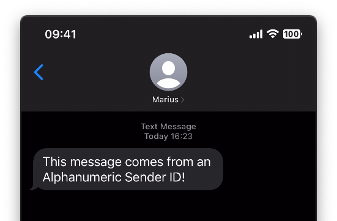

# Send SMS Without a Phone Number Using an Alphanumeric Sender ID

Sending SMS is a convenient way to notify your users about time-sensitive matters. These messages are often closely related to an action the user just triggered. For example, receiving a One-Time-Password (OTP) when transferring money from a banking app is common. In these situations, the user probably doesn’t mind which number sent the message. In other cases, especially when you notify users "out of the blue", you might prefer to display your company name as a sender. Alphanumeric Sender IDs allow you to do exactly that. 

[](https://www.twilio.com/blog/send-sms-without-phone-number-node-js)

This repository accompanies [this blog post](https://www.twilio.com/blog/send-sms-without-phone-number-node-js).


## Requirements
* You will need an [upgraded Twilio account](https://www.twilio.com/try-twilio).
* The code at the end of this post uses JavaScript, so make sure your [Node.js environment](https://nodejs.org/en/download/) is set up.


## Running the Code

1. Clone the project, change into the directory and install the dependencies:

    ```sh
    git clone https://github.com/IObert/twilio-sms-alphanumeric-sender-node
    cd twilio-sms-alphanumeric-sender-node
    ```

2. Create a new `.env` file. Here you're going to store the credentials you need to make calls to the Twilio API; your Account SID and Auth Token. You can find them in the [Twilio Console](https://www.twilio.com/console). Copy the lines below into .env and then paste the values of the two Twilio credentials in place of the two placeholders.
    ```sh
    TWILIO_ACCOUNT_SID=YOUR_ACCOUNT_SID 
    TWILIO_AUTH_TOKEN=YOUR_AUTH_TOKEN
    ```

3. Open the `send-alpha.js` file and substituted the parameters marked with `TODO` in the `client.messages.create()` function call.

4. Run the script on the command line to receive a message from your alphanumeric sender ID.

    ```bash
    node send-alpha.js
    ```

## You've Done It!

[](https://giphy.com/gifs/reactionseditor-reaction-26u4lOMA8JKSnL9Uk)